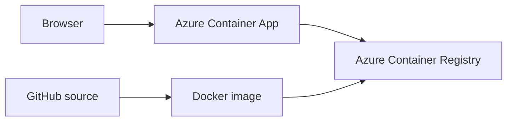

# Project 1 — West Africa Capitals Quiz: build and deployment record

## Goal

Build a playable West Africa capitals quiz and demonstrate Python, HTTP APIs, GitHub, Docker, Azure Container Registry, and Azure Container Apps. The live site is [West Africa Capitals Quiz](https://west-africa-quiz.orangetree-477f51ac.uksouth.azurecontainerapps.io).

## What users can do

- Answer one question for each of 16 West African countries, in a shuffled order.
- Choose from four capital cities and see the correct answer and a short fact.
- See a final score after question 16 and start a fresh round.

The score lives in the browser for the current round. There is no database or user account.

## Architecture



The browser loads HTML, CSS and JavaScript from the Python server. The server also handles JSON requests:

| Route | Purpose |
| --- | --- |
| `GET /` | Serves the quiz page |
| `GET /api/countries` | Lists the 16 countries |
| `GET /api/question?country=...` | Returns a country and four options |
| `POST /api/answer` | Checks an answer and returns the capital and fact |
| `GET /health` | Returns a small health response |

The browser shuffles the list of countries and asks each exactly once. The Docker image uses Python 3.12 slim, runs as a non-root user and listens on port 8000.

## Resources used

| Resource | Configuration |
| --- | --- |
| GitHub | [olumideakinseye77-glitch/Olu](https://github.com/olumideakinseye77-glitch/Olu) |
| Resource group | `rg-west-africa-quiz` |
| Region | UK South |
| Container Registry | `oluwestafricaquiz.azurecr.io` |
| Image | `west-africa-quiz:v1` |
| Container App | `west-africa-quiz` |
| Container Apps environment | Consumption workload profile |
| Ingress | Public HTTPS; target port 8000 |
| Registry authentication | Environment system-assigned managed identity with `AcrPull` |
| Registry admin account | Disabled after the image was deployed |

Logs were configured to stream without being stored in Log Analytics. Azure Container Registry can have ongoing charges; Container Apps consumption beyond its monthly free allowance can also incur charges.

## Build and verification

1. Ran `python3 app.py` on a Mac and opened `http://localhost:8000`. Requests for the page, static assets, questions and answers returned HTTP 200.
2. Built the image locally:

   ```bash
   docker build -t west-africa-quiz .
   docker run --rm -p 8000:8000 west-africa-quiz
   ```

3. Played through all 16 countries in Docker. Requests for each answer returned HTTP 200.
4. Tagged and pushed the image to ACR:

   ```bash
   docker tag west-africa-quiz:latest oluwestafricaquiz.azurecr.io/west-africa-quiz:v1
   docker push oluwestafricaquiz.azurecr.io/west-africa-quiz:v1
   ```

5. Deployed the image to Azure Container Apps with public ingress on port 8000. Opened the public URL and played the quiz.
6. Disabled the temporary registry admin account, restarted the active Container App revision, and confirmed the public quiz still worked. This verified that the managed identity can pull the image.

## Problems solved

| Problem | Cause | Resolution |
| --- | --- | --- |
| Webpage files returned 404 after upload | GitHub upload placed them at repository root; `app.py` expects a `static/` folder | Moved HTML, JavaScript and CSS into `static/` |
| `docker: command not found` on the Mac | Docker Desktop had not finished installation and setup | Installed and launched Docker Desktop, then opened a new Terminal |
| `TasksOperationsNotAllowed` from `az acr build` | This Azure subscription does not permit ACR Tasks builds | Built on the Mac with Docker and pushed the image to ACR |
| `Current Limit (F1 VMs): 0` | Free App Service plan quota was zero in the selected region | Deployed the existing image to Azure Container Apps Consumption instead |
| Registry admin credentials were needed for the first manual push | Docker on the Mac needed registry authentication | Enabled the registry admin user temporarily, then disabled it after confirming managed identity pull access |

## How to publish a later change

1. Update the code and push it to GitHub.
2. Build a new Docker image and tag it with a **new version** such as `v2`.
3. Authenticate to ACR using an appropriate identity, then push the new tag.
4. Change the Container App image tag to the new version and verify the live site.
5. Update this record with the new image tag and evidence.

The registry admin account is currently disabled, so the earlier admin password is not an update method. Use Azure CLI login on a workstation with Docker, or set up a GitHub Actions deployment workflow with scoped Azure credentials. Automatic CI/CD is a planned extension, not part of the current deployment.

## Portfolio explanation

This project demonstrates how a browser talks to a Python API, how Docker packages an app consistently, how an image is stored in ACR, how Azure Container Apps exposes a public endpoint, and how managed identity grants the app limited access to its image. The two Azure blockers above show practical troubleshooting and an architectural change based on quota and feature availability.
